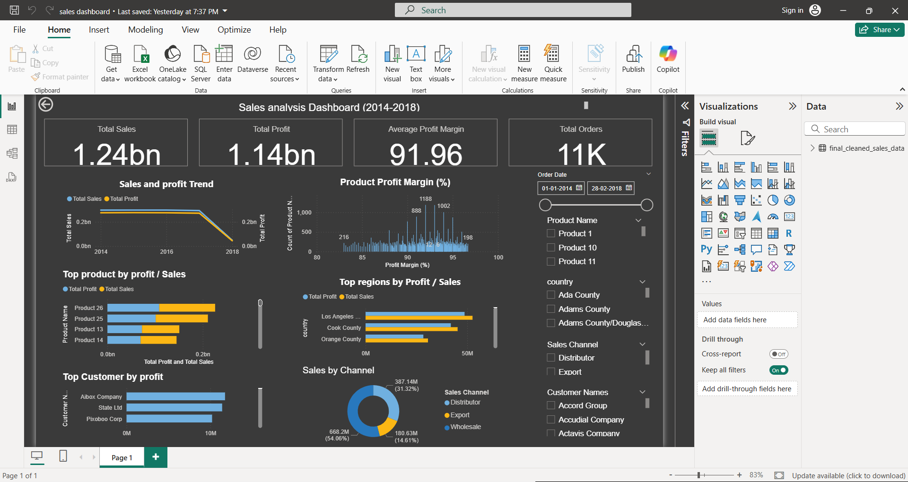

.

📈 Sales Performance Analysis (2014-2018)
Project Overview
This project involves a comprehensive sales analysis of a company's order data spanning over four years (2014-2018). The primary goal was to transform raw, disconnected data from multiple Excel sheets into a unified, clean dataset and extract key business insights related to sales trends, profitability, and customer/product performance.

The final, interactive dashboard (created in Power BI) provides a complete picture of the company's financial health and top-performing segments.

Key Features & Technical Skills
Data Wrangling & Cleaning: Used Python (Pandas) to load, clean, and pre-process over 64,000 sales records. This included standardizing column names, handling data types, and checking for duplicates/missing values (EDA confirmed zero missing values).

Data Integration: Merged four different data sheets (Orders, Customers, Products, and Regions) using unique index columns to create a single, master dataset.

Feature Engineering: Calculated critical business metrics, including Total Profit and Profit Margin (%).

Exploratory Data Analysis (EDA): Used Pandas aggregation functions and Seaborn to identify top performers and analyze feature correlation (see heatmap).

Visualization: Created an interactive Power BI Dashboard to visually track key performance indicators (KPIs).

Key Insights from Analysis
The analysis identified critical areas for business focus:

Total Sales & Profit: The company generated 1.24 Billion in Total Sales and 1.14 Billion in Total Profit, resulting in an Average Profit Margin of 91.96%.

Top Products: Product 26 ($108.7M Profit) and Product 25 ($101.3M Profit) are the most profitable products, indicating where resources should be focused.

Top Customers: Aibox Company ($11.7M Profit) and State Ltd ($11.4M Profit) are the highest-value customers.

Sales Channel: The Wholesale and Distributor channels are the primary drivers of sales volume.

Technologies Used
1. Data Cleaning & EDA-	(Python, Pandas, NumPy, Matplotlib, Seaborn)
2.Visualization & Reporting-	(Power BI)

Code Storage	Jupyter Notebook, GitHub

